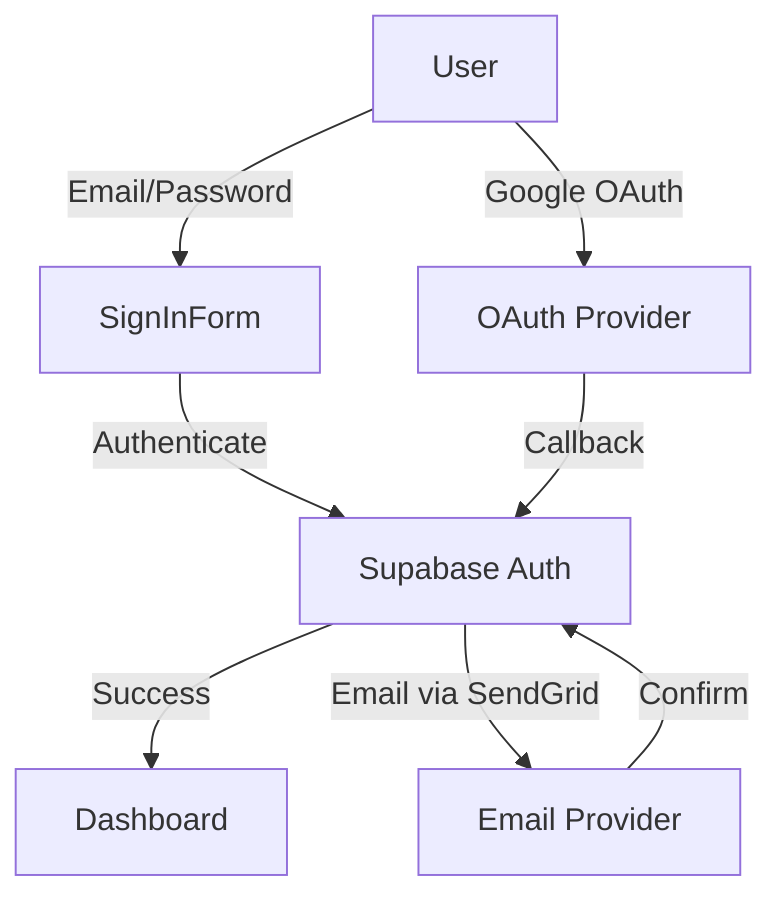
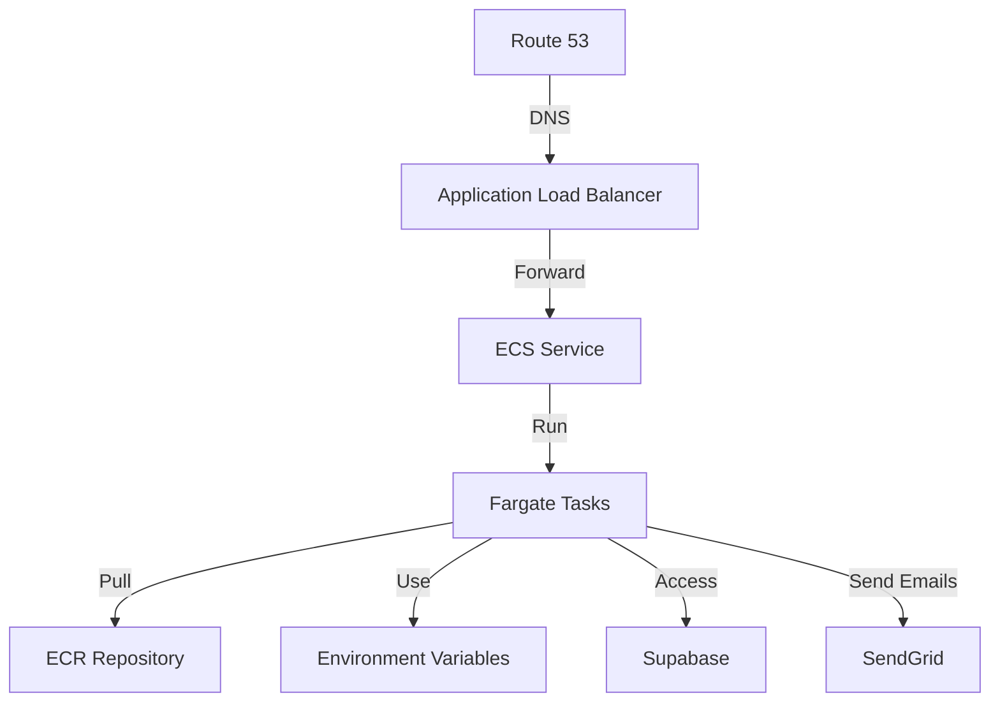

# Veyla AI Development Guide

## Current Status (as of Jan 8, 2025)

### ✅ Completed Features
1. **Authentication Core**
   - Email/Password authentication
   - Google OAuth integration
   - Password reset functionality
   - Debug logging for auth flows
   - Supabase integration

2. **Project Structure**
   - Next.js App Router migration
   - TypeScript configuration
   - Component organization
   - Environment setup

3. **Infrastructure Setup**
   - AWS CDK configuration
   - Docker containerization
   - Deployment scripts
   - Basic security setup

### 🚧 In Progress
1. **AWS Deployment (HIGH PRIORITY)**
   - [ ] Test deployment script locally
   - [ ] Verify environment variable handling
   - [ ] Test container builds
   - [ ] Initial deployment to AWS
   - [ ] Verify auth flows in production

2. **Email Service Integration**
   - [ ] SendGrid account setup
   - [ ] Test email templates
   - [ ] Verify email deliverability

### 🔜 Upcoming Features (Prioritized)
1. **Post-Deployment (Next Up)**
   - Basic monitoring setup
   - Error tracking
   - Performance monitoring
   - Health checks

2. **Auth Enhancements (After Stable Deployment)**
   - Additional OAuth providers
   - Enhanced session management
   - Role-based access control

3. **Future Improvements**
   - Custom domain and SSL
   - Advanced monitoring
   - Additional email templates
   - User management dashboard

## Deployment Guide

### Prerequisites
```bash
# Required environment variables
NEXT_PUBLIC_SUPABASE_URL=your_supabase_url
NEXT_PUBLIC_SUPABASE_ANON_KEY=your_supabase_anon_key
SENDGRID_API_KEY=your_sendgrid_api_key
SMTP_SENDER=your_verified_sender@domain.com
```

### Local Development
1. Install dependencies:
```bash
cd packages/dashboard
npm install
```

2. Run development server:
```bash
npm run dev
```

### AWS Deployment Steps
1. **Configure AWS CLI**
```bash
aws configure
# Enter your AWS credentials when prompted
```

2. **First-time Setup**
```bash
# Install CDK globally
npm install -g aws-cdk

# Bootstrap CDK (first time only)
cd infrastructure
cdk bootstrap
```

3. **Deploy**
```bash
# From project root
./scripts/deploy.sh
```

### Deployment Verification Checklist
- [ ] Application loads at ALB DNS
- [ ] Sign up flow works
- [ ] Sign in flow works
- [ ] Google OAuth works
- [ ] Password reset flow works
- [ ] Emails are being sent
- [ ] Session persistence works

## Architecture

### Authentication Flow


### Infrastructure


## Development Guidelines

### Code Organization
```
veyla-ai/
├── packages/
│   ├── dashboard/          # Main application
│   │   ├── app/           # Next.js App Router
│   │   ├── components/    # React components
│   │   └── lib/          # Utilities
│   └── landing/          # Landing page
├── infrastructure/       # AWS CDK code
└── scripts/             # Deployment scripts
```

### Best Practices
1. **Deployment**
   - Always test locally first
   - Deploy to staging before production
   - Monitor logs during deployment
   - Have rollback plan ready

2. **Development**
   - Write meaningful commit messages
   - Add debug logs for auth flows
   - Test all auth scenarios
   - Keep environment variables updated

3. **Testing**
   - Test auth flows end-to-end
   - Verify email delivery
   - Check OAuth redirects
   - Validate error handling

## Next Steps (In Order)
1. Complete AWS deployment
2. Verify all auth flows in production
3. Set up basic monitoring
4. Add production error handling
5. Document production issues
6. Plan next feature set

## Common Issues and Solutions
1. **Deployment Failures**
   - Check AWS credentials
   - Verify environment variables
   - Check container logs
   - Verify security groups

2. **Auth Flow Issues**
   - Check Supabase configuration
   - Verify OAuth settings
   - Check email templates
   - Monitor auth logs

3. **Email Issues**
   - Verify SendGrid API key
   - Check sender verification
   - Monitor email logs
   - Test email templates
