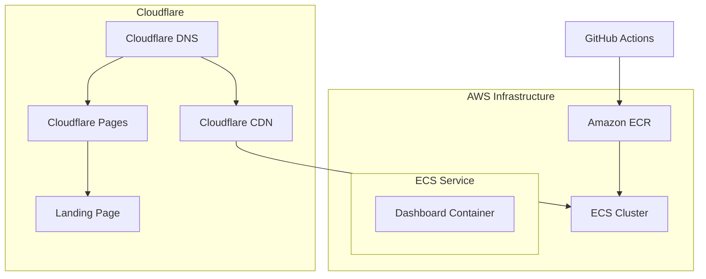

# Veyla AI Deployment Guide

## Current Infrastructure

## Current Setup

1. **Landing Page (veylaai.com)**
   - Hosted on Cloudflare Pages
   - Auto-deploys from GitHub
   - Protected by Cloudflare CDN

2. **Dashboard (app.veylaai.com)**
   - Container Registry: Amazon ECR (veyla-dashboard)
   - Compute: AWS ECS Fargate
   - Cluster: VeylaStack-VeylaClusterBA05EB56-YlYM8byJoP7n
   - Service: VeylaStack-DashboardService73233129-yBxSXJ9iveDw

3. **Deployment Pipeline**
   - Triggered on pushes to main branch
   - Builds Docker image with Next.js application
   - Pushes to Amazon ECR
   - Updates ECS service for deployment

4. **Environment Variables**
   - NEXT_PUBLIC_SUPABASE_URL
   - NEXT_PUBLIC_SUPABASE_ANON_KEY
   - NEXT_PUBLIC_APP_URL
   - Stored in GitHub Secrets
   - Passed to container during build

## AWS Resources

### Container Registry (ECR)
- Repository: veyla-dashboard
- Features:
  - Image scanning enabled
  - AES256 encryption
  - Immutable tags

### ECS Configuration
- Launch Type: Fargate
- Networking: VPC with public subnets
- Port: 3000 (Next.js default)

### GitHub Actions Workflow
Located in `.github/workflows/deploy-dashboard.yml`:
1. Configures AWS credentials
2. Creates ECR repository if needed
3. Builds and pushes Docker image
4. Updates ECS service

## Current Status

### Completed
- ECR repository setup
- Docker image build pipeline
- ECS deployment workflow
- Environment variable configuration

### In Progress
- Health check implementation
- Logging configuration
- Monitoring setup

### Pending
- Auto-scaling configuration
- Staging environment
- Performance optimization
- Cost monitoring

## Quick Reference

### Important URLs
- Landing Page: https://veylaai.com
- Dashboard: https://app.veylaai.com
- Container Registry: 311141528083.dkr.ecr.us-east-2.amazonaws.com/veyla-dashboard

### AWS Resources
- Region: us-east-2
- ECR Repository: veyla-dashboard
- ECS Cluster: VeylaStack-VeylaClusterBA05EB56-YlYM8byJoP7n
- ECS Service: VeylaStack-DashboardService73233129-yBxSXJ9iveDw

### Required Permissions
AWS IAM permissions needed:
- ecr:*
- ecs:*
- logs:*
- ec2:DescribeVpcs
- ec2:DescribeSubnets
- ec2:DescribeSecurityGroups

## Next Steps

1. **Monitoring & Observability**
   - Set up CloudWatch dashboards
   - Configure alarms for key metrics
   - Implement structured logging

2. **Performance**
   - Implement auto-scaling
   - Optimize container resources
   - Set up performance monitoring

3. **Security**
   - Review security group rules
   - Implement AWS WAF
   - Set up audit logging

4. **Cost Optimization**
   - Set up cost alerts
   - Review resource utilization
   - Optimize container sizing
