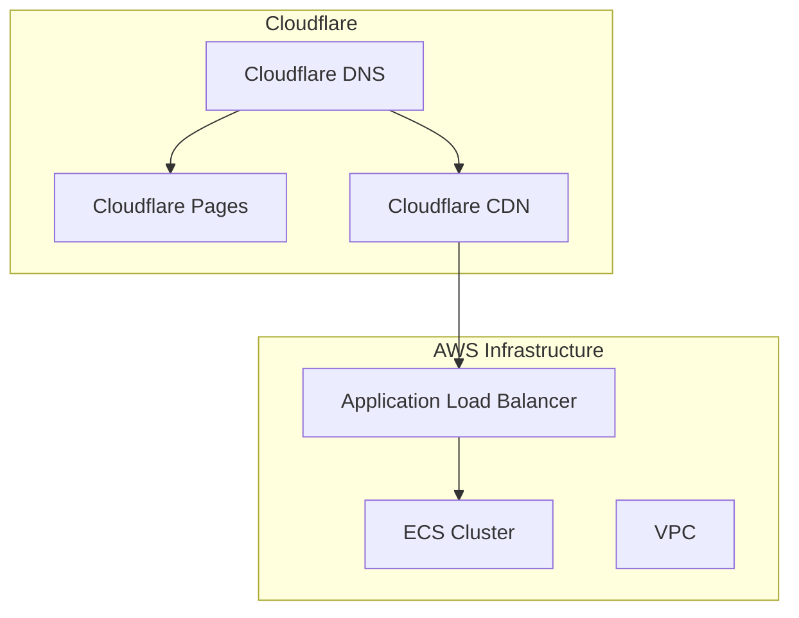

# Veyla AI Deployment Guide

## Current Infrastructure

## Current Setup

1. **Landing Page (veylaai.com)**
   - Hosted on Cloudflare Pages
   - Auto-deploys from GitHub
   - Protected by Cloudflare CDN

2. **Dashboard (app.veylaai.com)**
   - Load Balancer: VeylaS-Veyla-wt03F2Rvg8eo-514118397.us-east-2.elb.amazonaws.com
   - Infrastructure deployed on AWS
   - Traffic proxied through Cloudflare

3. **DNS Configuration**
   - Managed by Cloudflare
   - Landing page: CNAME to veyla-ai.pages.dev
   - Dashboard: CNAME to AWS ALB

## Remaining Work

### High Priority
1. **Dashboard Deployment**
   - Complete ECS service configuration
   - Set up container deployment pipeline
   - Configure environment variables
   - Set up health checks

2. **Security**
   - Configure HTTPS listeners on ALB
   - Set up AWS WAF (if needed)
   - Review security group rules
   - Implement proper logging

3. **Monitoring**
   - Set up CloudWatch alarms
   - Configure performance monitoring
   - Set up error tracking
   - Create dashboard for key metrics

### Future Improvements
1. **Scalability**
   - Implement auto-scaling for ECS
   - Configure load balancer thresholds
   - Set up performance testing

2. **Development Workflow**
   - Create staging environment
   - Set up CI/CD pipeline for dashboard
   - Implement automated testing

3. **Cost Optimization**
   - Review resource utilization
   - Set up cost alerts
   - Optimize instance sizes

## Quick Reference

### Important URLs
- Landing Page: https://veylaai.com
- Dashboard: https://app.veylaai.com (once DNS propagates)
- ALB DNS: VeylaS-Veyla-wt03F2Rvg8eo-514118397.us-east-2.elb.amazonaws.com

### AWS Resources
- Region: us-east-2
- VPC ID: vpc-0dee1aa0364150885
- Load Balancer: VeylaS-Veyla-wt03F2Rvg8eo

### Cloudflare Configuration
- SSL/TLS: Full (Strict)
- Always Use HTTPS: Yes
- Auto Minify: Enabled
- Brotli: Enabled
