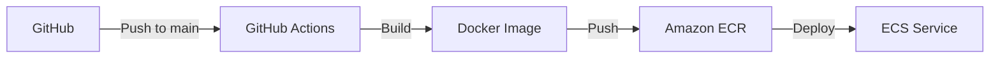

# ECS Deployment Plan for Veyla Dashboard

## Current Infrastructure

### Components
1. **ECS Cluster**
   - Name: VeylaStack-VeylaClusterBA05EB56-YlYM8byJoP7n
   - Type: Fargate
   - Region: us-east-2

2. **ECS Service**
   - Name: VeylaStack-DashboardService73233129-yBxSXJ9iveDw
   - Task Definition: Next.js application
   - Port: 3000

3. **ECR Repository**
   - Name: veyla-dashboard
   - Features:
     - Image scanning
     - AES256 encryption
     - Immutable tags

### Deployment Pipeline


## Resource Configuration

### ECS Task Definition
```json
{
  "cpu": "256",
  "memory": "512",
  "containerDefinitions": [
    {
      "name": "dashboard",
      "image": "311141528083.dkr.ecr.us-east-2.amazonaws.com/veyla-dashboard:latest",
      "portMappings": [
        {
          "containerPort": 3000,
          "protocol": "tcp"
        }
      ],
      "environment": [
        {
          "name": "NEXT_PUBLIC_SUPABASE_URL",
          "value": "from_github_secrets"
        },
        {
          "name": "NEXT_PUBLIC_SUPABASE_ANON_KEY",
          "value": "from_github_secrets"
        },
        {
          "name": "NEXT_PUBLIC_APP_URL",
          "value": "from_github_secrets"
        }
      ]
    }
  ]
}
```

## Deployment Workflow

### Current GitHub Actions Workflow
Located in `.github/workflows/deploy-dashboard.yml`:
1. Configure AWS credentials
2. Create ECR repository if needed
3. Build and tag Docker image
4. Push to ECR
5. Update ECS service

### Required Secrets
- AWS_ACCESS_KEY_ID
- AWS_SECRET_ACCESS_KEY
- NEXT_PUBLIC_SUPABASE_URL
- NEXT_PUBLIC_SUPABASE_ANON_KEY
- NEXT_PUBLIC_APP_URL

## Next Steps

### Phase 1: Monitoring
1. **Health Checks**
   ```typescript
   // Add to task definition
   healthCheck: {
     command: ["CMD-SHELL", "curl -f http://localhost:3000/api/health || exit 1"],
     interval: 30,
     timeout: 5,
     retries: 3
   }
   ```

2. **CloudWatch Logs**
   ```typescript
   // Add to task definition
   logConfiguration: {
     logDriver: "awslogs",
     options: {
       "awslogs-group": "/ecs/veyla-dashboard",
       "awslogs-region": "us-east-2",
       "awslogs-stream-prefix": "ecs"
     }
   }
   ```

### Phase 2: Auto-scaling
1. **Service Auto-scaling**
   ```typescript
   // Target tracking policy
   {
     targetValue: 75,
     scaleOutCooldown: 300,
     scaleInCooldown: 300,
     predefinedMetric: "ECSServiceAverageCPUUtilization"
   }
   ```

2. **Capacity Limits**
   - Minimum: 1 task
   - Maximum: 4 tasks
   - Desired: 1 task

### Phase 3: Cost Optimization
1. **Resource Monitoring**
   - Track CPU utilization
   - Monitor memory usage
   - Review scaling patterns

2. **Budget Alerts**
   ```typescript
   {
     amount: 100,
     timeUnit: "MONTHLY",
     alerts: [
       { threshold: 80, email: "team@veylaai.com" }
     ]
   }
   ```

## Rollback Strategy

### Quick Rollback Steps
1. Revert to previous task definition
   ```bash
   aws ecs update-service \
     --cluster VeylaStack-VeylaClusterBA05EB56-YlYM8byJoP7n \
     --service VeylaStack-DashboardService73233129-yBxSXJ9iveDw \
     --task-definition PREVIOUS_TASK_DEF
   ```

2. Monitor deployment
   ```bash
   aws ecs describe-services \
     --cluster VeylaStack-VeylaClusterBA05EB56-YlYM8byJoP7n \
     --services VeylaStack-DashboardService73233129-yBxSXJ9iveDw
   ```

### Emergency Procedures
1. Scale down to 0 if needed
2. Check CloudWatch logs
3. Review error patterns
4. Notify team via Slack
