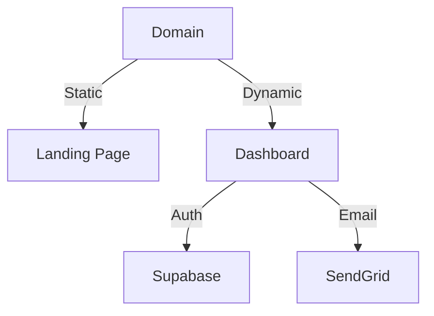
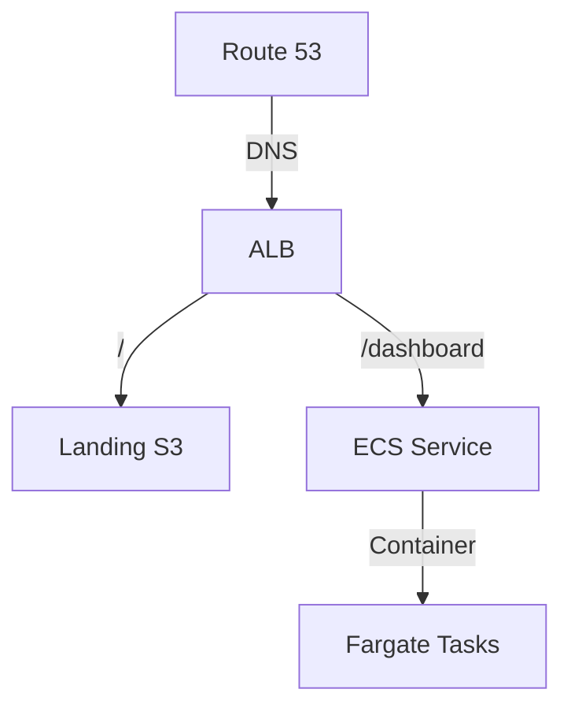

# Veyla AI Project Progress

## Current Status (as of Jan 8, 2025)

### ✅ Completed Features

1. **Authentication System**
   - Email/Password authentication with Supabase
   - Google OAuth integration
   - Password reset functionality
   - Debug logging for auth flows
   - Email templates for auth flows
   - SendGrid integration

2. **Project Structure**
   - Monorepo setup with packages:
     - `dashboard`: Main application (Next.js)
     - `landing`: Static landing page
   - TypeScript configuration
   - Environment setup
   - Component organization

3. **Infrastructure Setup**
   - AWS CDK configuration
   - Docker containerization
   - Basic security groups
   - VPC configuration
   - Load balancer setup

### 🚧 In Progress

1. **Cloud Deployment (HIGH PRIORITY)**
   - [ ] Deploy landing page
   - [ ] Deploy dashboard
   - [ ] Link existing domain
   - [ ] Set up SSL certificates
   - [ ] Configure DNS

2. **Integration Testing**
   - [ ] Test auth flows in production
   - [ ] Verify email sending
   - [ ] Check OAuth redirects

### 🔜 Next Up (Prioritized)

1. **Post-Deployment**
   - Basic error tracking
   - Health checks
   - Log monitoring

2. **Feature Enhancements**
   - Profile management
   - User dashboard
   - Additional OAuth providers

## Architecture Overview

### Current Architecture

### Infrastructure

## Package Status

### Landing Page (`packages/landing`)
- ✅ Static site built
- ⏳ Needs deployment to S3/CloudFront
- ⏳ DNS configuration pending

### Dashboard (`packages/dashboard`)
- ✅ Auth system complete
- ✅ Basic UI implemented
- ⏳ Deployment configuration ready
- ⏳ Production testing pending
